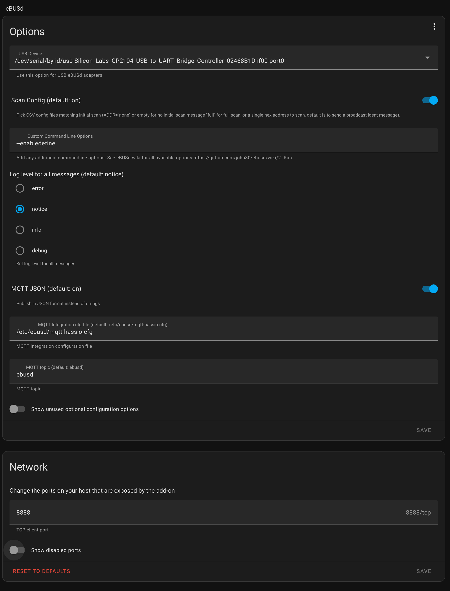

# ebus thermostat 🌡️

## What

Control Vaillant (or other ebus connect heater) yourself. Supports day/night modes (low/high).

While this has been tested over a couple of months, usage of this thermostat is *entirely* at your own risk.
It may work, it could do nothing, or it might produce superheated plasma and scare your cat.

## Tap water temperature notice

Controlling the heater involves setting the heating circuit and hot water circuit temps. This plugin will set your hot tap
water temperature to a sensible 50 C by default, do not forget to change this if needed in the configuration before 
starting the thermostat.

## Requirements

- ebus enabled heater (Vaillant etc)
- [ebusd](https://github.com/john30/ebusd), available as a [HA plugin (recommended)](https://github.com/LukasGrebe/ha-addons)
- ebus adapter board supported by ebusd
- MQTT server accessible by HA and this addon
- thermometer entity in HA

## Configuration

**You need to have a working ebusd instance connected to your heater prior to executing these steps.**

1. [Add this addon repository to your HA install](https://developers.home-assistant.io/docs/add-ons/repository/#installing-a-repository)
2. Configure the ebusd to allow custom message definitions (add `--enabledefine` to the commandline)
3. Set the ebusd network port
4. Add a MQTT thermostat to your HA configuration.yaml. Do not alter the topic names. Reload or restart HA when added.
```yaml
 mqtt:
   climate:
     - name: Heating
       unique_id: Vaillant EcoTec Exclusive
       max_temp: 23
       min_temp: 20
       precision: 0.1
       temp_step: 0.5
       modes:
         - auto
         - heat
         - "off"
       mode_state_topic: "ebus-thermostat/mode"
       mode_command_topic: "ebus-thermostat/mode/set"
       temperature_state_topic: "ebus-thermostat/temp"
       temperature_low_state_topic: ebus-thermostat/temp/low"
       temperature_high_state_topic: "ebus-thermostat/temp/high"
       temperature_low_command_topic: "ebus-thermostat/temp/low/set"
       temperature_high_command_topic: "ebus-thermostat/temp/high/set"
       current_temperature_topic: "ebus-thermostat/temp"
```
5. Configure the thermostat plugin in HA
6. Enjoy the heat 🔥

Example ebusd config using the HA addon:



## Why

When switching to a more powerful heater, I could no longer use the old thermostat. Instead of buying a new, expensive, one,
I just built one myself. This has the added advantage of being able to run the heating circuit at any desired temp. The old
Vaillant thermostat would only call for ~52 C temp on the circuit, on cold days this caused not enough of a temp difference for
the radiators to be able to dump enough heat in the room and so the desired temp was never reached.
With this thermostat, you can go up as high as you'd like.

## TODOs

These are ideas for future refinements that might never be implemented. Help is appreciated!

- Use heating circuit temp curve instead of static temp when desired temperature cannot be achieved in certain timespan
- Make hot water temp configurable as a HA entity